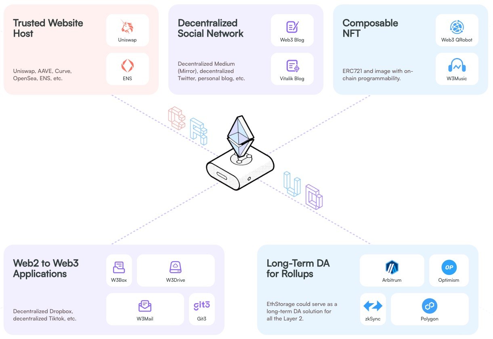

---
layout:
  title:
    visible: true
  description:
    visible: false
  tableOfContents:
    visible: true
  outline:
    visible: true
  pagination:
    visible: true
---

# Overview

## What is EthStorage

EthStorage is a modular permanent data availability and storage layer on Ethereum.

With its permanent and high availability, as well as innovative petabyte capacity, EthStorage revolutionizes data availability and storage on the Ethereum platform without requiring any protocol upgrade.

## Motivation

The main motivation behind EthStorage is to provide a long-term DA based on Ethereum.

EIP-4844 introduces data blobs that enhance the throughput and efficiency of L2 scaling solutions like rollups. However, the blob data is only available temporarily, meaning it will be discarded in a few weeks. This has generated a significant impact: the inability of L2 to unconditionally derive the latest state from L1. If a certain piece of data can no longer be retrieved from L1, a rollup may not be possible to sync the chain.

With EthStorage as a long-term DA solution, L2s can derive from their DA layer (Ethereum DA, Celestia, EigenDA, etc. + EthStorage) any time they want.

EthStorage also opens up new possibilities for fully on-chain applications like games, social networks, AI, etc.

<figure><figcaption></figcaption></figure>
