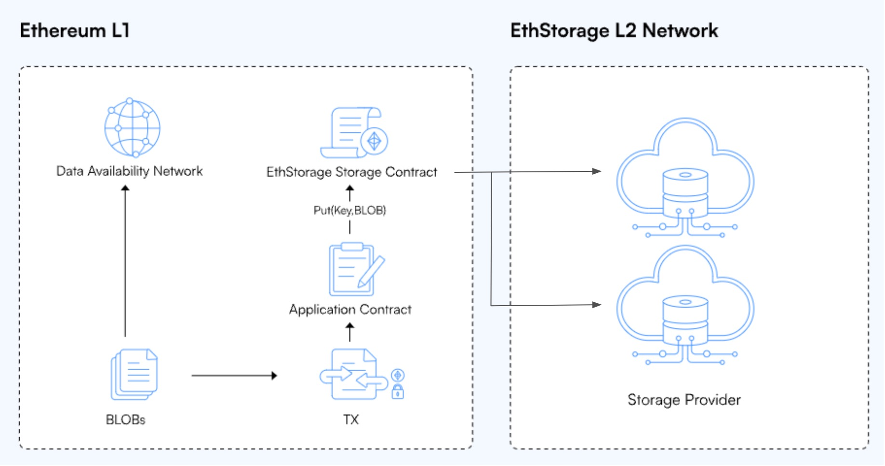

# OP Stack Tutorial

This tutorial provides practical instructions and code examples for developers intending to integrate EthStorage with an OP Stack testnet as a long-term DA solution.

## L1 Contracts

In the OP Stack, the `BatchInbox` is an L1 address to which the L2 batch submitter, or batcher, submits transaction batches in the form of L1 calldata or blobs. It is currently designed as a standard Externally Owned Account (EOA) address to reduce gas costs by avoiding the execution of any EVM code.

To enable EthStorage to store transaction batches as blobs, a smart contract must be deployed to accept blob transactions from the batch submitter to replace the EOA. Subsequently, the smart contract invokes the `put(key, blob)` function of the EthStorage storage contract.

<figure><figcaption><p>The BatchInbox Contract serves as the Application Contract in the rollup integration scenario</p></figcaption></figure>

An early version of the `BatchInbox` smart contract with EIP-4844 integration can be found [here](https://github.com/ethstorage/es-op-batchinbox/blob/main/src/BatchInbox.sol). The smart contract employs the blobhash of the blob as the key to put the blob in the EthStorage's key-value store, and covers the upfront storage payment using its ETH balance.

The EthStorage storage contract address on the Sepolia testnet can be found [here](../information/#public-testnet-1-deployment).

## L2 Batch Submitter

Some essential changes need to be made for the OP Stack's batch submitter when the `BatchInbox` is a smart contract.

Firstly, it will check if the `BatchInbox` address is a smart contract or an EOA. It is important to estimate gas usage before submitting the transaction to the smart contract, , rather than relying on intrinsic gas as in the EOA case. Furthermore, when interacting with a smart contract, it is crucial to implement the verification of transaction status and error handling to ensure data integrity.

For detailed implementation, refer to [this pull request](https://github.com/ethstorage/optimism/pull/22).

## Blob Retrieval

The Ecotone upgrade enables the OP Stack to use EIP-4844 blobs as DA source for L2 chain derivation. A blob can be retrieved from any one of several different sources configured. With a Beacon node location configured, an op-node is expected to retrieve blobs that within the retention window (\~18 days) from a local Beacon node or a third-party RPC service.

Another configurable option, `--l1.beacon-archiver`, enables op-nodes to fetch the expired blobs that normal Beacon nodes would "prune" or remove from [EthStorage blob archiver API](./#introduction-to-ethstorage-archiver-api).

The following example specifies a living EthStorage archiver API on the Sepolia testnet.

```
--l1.beacon-archiver http://65.108.236.27:9645
```

Like the Beacon API, the blobs can be queried via the `/eth/v1/beacon/blob_sidecars/` endpoint, using the `indices` filter to skip irrelevant blobs. The process operates by combining the archiver and the Beacon location into a resource pool for retrieving blobs. If the op-node fails to obtain blobs from the Beacon node, it will use the archiver endpoint as a fallback.

One detail worth noting is how the Beacon API's response to expired blobs affects the retrieval process. At least some of the Beacon clients (e.g., [Prysm](https://github.com/prysmaticlabs/prysm/blob/feb16ae4aaa41d9bcd066b54b779dcd38fc928d2/beacon-chain/rpc/lookup/blocker.go#L225)) return 200 status code and an empty list while [the OP Stack code](https://github.com/ethereum-optimism/optimism/blob/develop/op-service/sources/l1\_beacon\_client.go#L212) is expecting an error. [Addressing this issue](https://github.com/ethereum-optimism/optimism/pull/10269) is crucial for the proper functioning of the retrieval of historical blobs.
